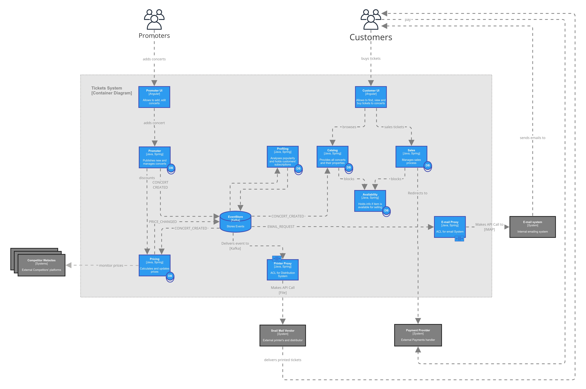

# About `Tickets`

## Business goal

Ticketing system is a cutting-edge concert tickets selling platform with a revolutionary pricing algorithm and super friendly for Concert Promoters to sell their concerts with a remarkable profit.

Full documentation here: [Tickets doc.pdf](https://drive.google.com/file/d/1wHNTqUuKC_To8y9hnwEq6-izZE2G6eSh/view?usp=sharing)

## Purpose

The system is built as a training example for [Testing Microservices](https://bottega.com.pl/szkolenie-ms-testing).

## Architecture

The overall System consists of many microservices. This repository holds a subset of them, essential for Promoter to create concerts. High level architecture is below.



# Importing to IDE

## How to import

You should import the `Tickets/build.gradle` as a root project to your IDE.

## Project Structure

Important paths in project are:

```
Tickets
└── infra/kafka/docker-compose.yml              // Use to start Apache Kafka in docker on your machine
└── libs/SharedLib                              // Java library embedded in services
└── services                                    // Microservices in Tickets system
│   └── Pricing
│   └── Promoter
|       └── api-stubs/run-contract-stubs.sh     // runs Promoter API Stubs based on Contract Tests to test promoter-ui
│   └── promoter-ui
└── SystemTests/TicketingTests                    // separate project holding E2E System Tests for Ticketing
```

## Setup Contract tests

Contract tests require additional setup on your machine to run. make sure you follow [contract tests configuration](#contract-tests).

## Verify after import

Execute tests to check if the system is working on your machine and tests are green: `Tickets test --all` or `./gradlew test`

## Speed up test execution

Gradle has a bug, and it may execute tests slowly. Use IntelliJ Idea for build and test execution.

Go to: `Settings -> Build, Execution Deployment -> Build Tools -> Gradle` and set `Build and Run using` and `Run tests using` to value: `IntelliJ Idea` (not Gradle)

# How to run the system

Repository contains gradle and IntelliJ run configurations. IntelliJ configurations should be automatically imported once `Tickets` project is imported.

Some run configurations are using [Multirun plugin](https://plugins.jetbrains.com/plugin/7248-multirun) to start all microservices in the system. Consider installing it.

To see the system working, start services:

| Service      | IntelliJ Idea task | Manual command                                                          |
|--------------|--------------------|-------------------------------------------------------------------------|
| Kafka        | `kafka run`        | run `docker-compose.yml` using `docker compose up` under `infra/kafka/` |
| Promoter GUI | `promoter-ui run`  | `ng serve` from `promoter-ui/` (starts on port 4200)                    |
| Promoter     | `Promoter run`     | `./gradlew bootRun` from `Promoter/`                                    |
| Pricing      | `Pricing run`      | `./gradlew bootRun` from `Pricing/`                                     |


# Prerequisites

## Backend

Installed:

- gradle
- JDK 21+
- IDE (recommended: IntelliJ Idea)
- git
- docker
- docker compose
- Operating System: Ubuntu, Mac, Windows. Note: docker on Windows can be unpredictable.

## Web interface

Installed:

- node.js `sudo apt install nodejs`
- Angular `npm install -g @angular/cli`
- Protractor `npm install -g protractor`
- Chrome Browser

Before start, install node dependencies by running `npm install` from `services/promoter-ui`

# Tests

## `Pricing`, `Promoter` and `SharedLib`

- All internal tests are under `src/test/java`
- contract tests location is documented [here](#contract-tests)

Execute gradle tasks by `./gradlew <task-name>`
- `test`: runs all in-service tests
- `contractTest`: runs Spring Cloud Contract tests defined in `/src/contractTests/resources/contracts`

## `promoter-ui`

Protractor tests are located under `src/e2e/test`

- `protractor conf.js` executes isolated GUI tests on `promoter-ui`. Note: execute from `services/promoter-ui/src/e2e`

## `TicketingTests`

The project holds System Tests only, all under `src/test` with gradle task:

- `test`: runs tests against the Tickets System

## <a name="contract-tests"></a> Contract tests

Two tools for contract testing are implemented: `Spring Cloud Contract` and `PACT`. Contract testing requires additional infrastructure. To make contract tests green, follow instructions below.

### Spring Cloud Contract 

Spring Cloud Contracts [SCC] uses local maven repository to publish contracts defined in sources. If producer contracts are missing in local repository, the consumer tests may fail because of `AetherStubDownloader` cannot download stubs. 

#### Publishing

Publish contracts execute `./gradlew publishToMavenLocal` in `Promoter` and `Pricing` or run IntelliJ configs named `Promoter/Pricing contract publish`.

#### Promoter API Stubs

To start Promoter Stub (optional), based on Contract tests, see [README](services/Promoter/api-stubs/README.MD)

#### Locations

- Contracts are under `src/contractTest/resources`
- Generated contract tests are in `build/generated-test-sources/contractTest`

### Pact

Tests named `pactVerificationTestTemplate` are PACT contract tests, and they will be failing on your machine as they require secret token to PACT Broker. Secret will be provided to you later. You can ignore these failures for now.

#### Publishing

There are Consumer, Provider and Pact Broker contracts verified using Pact Flow. Contract tests are fired like any other Framework Tests. There are additional steps for publishing pact verification results:
- consumer: `./gradlew pactPublish` (update pact `consumerVersion` if needed in `build.gradle`)
- provider: published automatically after verification, by setting `pact.verifier.publishResults` to `true` in `setupTestTarget`

#### Locations

- provider tests have suffix `pact*Test`
- consumer tests are annotated with `@PactTestFor`

#### Set credentials in env vars

Pact Broker is secured. Credentials are stored as environment variables. To set them execute:

##### Linux

```shell
export VAR_NAME="<value>"     # add this line to /etc/profile to make it persistent
source ~/.bashrc              # reload new vars into current session
printenv VAR_NAME             # check if variable is set
```

##### Windows

```powershell
$env:VAR_NAME="<value>"
$env:VAR_NAME                 # check if variable is set
```

# Branching and Rebasing

Complete solution is on the `main` branch.

## Development

All feature development is made in branches as follows:
1. start new branch from `main`
2. When finished, Issue PR to `main`, squashing commits.
3. Remember to rebase assignment branches on `main` to reflect new features (see [Rebasing](#rebasing))

## Branches with assignments

Training assignments:

- use branches corresponding to the tasks and their steps
- are prefixed with `x-` in the branch name

## <a name="rebasing"></a> Rebasing

Branches with assignments must be rebased on `main` to reflect new features added to `main` in assignments branches. Use `rebaser.sh` to rebase:
1. Navigate to `Tickets/.github` directory (on Windows use Git Bash)
2. Run `./rebaser.sh` to rebase and push all branches starting with `x-` on `main`

# Open API Docs

Auto generated Open API Docs are available under:
- json: `http://localhost:{port}/v3/api-docs`
- yaml: `http://localhost:{port}/v3/api-docs.yaml`
